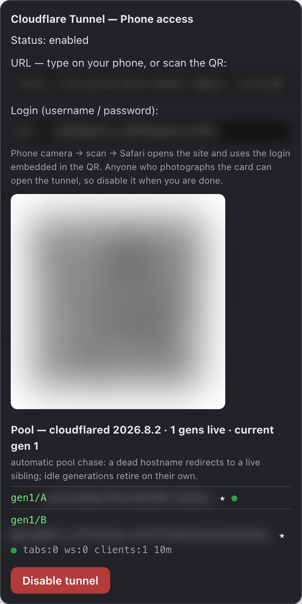

# phone-tunnel-pool — Cloudflare quick-tunnel pool for the dsh web GUI

**English** | [简体中文](./README.zh-CN.md)

Enable/disable a **self-healing Cloudflare quick-tunnel pool** for
`http://127.0.0.1:3080` (the DeepSeek Harness web GUI) from a floating widget
with a scannable QR code. One scan from your phone, and the pool keeps
itself alive:

- **Generational rotation (12h):** a new pair of tunnels spawns on schedule;
  older generations stay alive while anything is still on them.
- **Chase service worker:** every origin your browser touches registers a
  service worker. Dead or rotated hostnames redirect to a live sibling or the
  newest primary — the same open tab survives generation changes as long as
  it stays connected.
- **Prompt-free migrations:** the proxy injects credentials only into pages it
  has already authenticated; before any redirect the watchdog pre-authenticates
  the target hostname (minting its auth cookie), so migrations land
  authenticated — no "Authentication required" popups.
- **Usage-based retirement:** generations retire only when idle
  (no tabs / websockets / recent traffic) or at a hard age cap.
- **Respawn with backoff:** dead tunnels are replaced with new hostnames;
  quick-tunnel mint quota (Cloudflare 429) is respected via exponential
  backoff + a 2-probe dead-grace (DNS propagation).

Extra: the daemon runs detached and **adopts** across `dsh web` restarts, so
the same URL, password and QR stay valid until you click Disable — no
re-scan (an OS reboot still costs one fresh scan; a named tunnel removes even
that — see [`PLAN.md`](./PLAN.md) §7).

## Install / Uninstall

```bash
# install (from this public repo)
dsh plugin --profile web add github:iimaguest/phone-tunnel-pool
dsh web        # the GUI shows a floating 📱 widget (bottom-right)

# uninstall (one command — removes the dependency AND the dsh.profile.bundles layer)
dsh plugin --profile web remove phone-tunnel-pool
dsh web
```

After install: open the widget → **Enable** → scan the QR with your phone
camera. Install/remove reconcile `dsh.profile.bundles` against the installed
state automatically — **never edit `~/.dsh/profiles/web/package.json` by hand**;
a stray bundle entry with no matching dependency is exactly the kind of state
that fails profile boot ("cannot resolve profile bundle").

## Prerequisites (all of them)

| What | Needed? | Who provides it |
|---|---|---|
| `dsh web` running on its default port **3080** (`DSH_TARGET_PORT` to override) | required | you (the plugin tunnels *to* it) |
| `cloudflared` binary on PATH | required | you — `brew install cloudflared` (or apt/dnf/Chocolatey, or set `DSH_CLOUDFLARED` to the existing binary) |
| Node.js runtime | required | dsh itself — no separate install (the daemon reuses dsh's node) |
| `python3` + `qrcode` package | optional | you — `pip install qrcode`; without it the widget shows URL + login instead of a scannable QR |
| `caffeinate` | optional | macOS ships it; skipped elsewhere |
| PowerShell | optional | Windows ships it — used only for process cleanup on Windows (no `pkill` there) |
| Outbound network | required | cloudflared → Cloudflare edge on 443/7844 (no inbound port needed) |

The widget **preflights these on dsh web start** and shows a yellow warning
line (with the exact fix, e.g. `brew install cloudflared`) before you even
click Enable; the daemon also fails fast with a readable error if cloudflared
is missing at Enable time, and `refresh` in the popup re-checks everything —
a stale error clears once the prereqs pass.

The feature flag set is version-gated on `cloudflared --version`:
2024.6+ enables the opt-in post-quantum handshake (`DSH_PQ=1`), 2024.8+ adds
`--management-diagnostics=false`; older builds (apt/dnf packages) get a
reduced, compatible flag set.

**Platforms.** macOS, Linux and Windows (Windows uses PowerShell for process
cleanup; `caffeinate` is macOS-only and silently skipped elsewhere). The
daemon's state file and log live in the per-OS temp directory
(`os.tmpdir()`); the widget settings file (`iptunnel-settings.json`) lives in
`~/.dsh`.

## Screenshots

<p align="center">
  
</p>

<p align="center">
  
</p>

*Live hostnames, credentials and the QR are blurred out in these shots.*

## How it's wired

```
dsh web GUI  <--  /iptunnel routes  --  auth proxy (127.0.0.1:3090)
                                              │  Basic + session cookie,
                                              │  Host rewrite to 127.0.0.1:3080
                                              │  (the GUI's browser-trust fence)
                                              ▼
cloudflared A ─ to ─ auth proxy ───────────────────────────────────┐
cloudflared B ─ to ─ auth proxy ───────────────────────────────────┤ (tunnel daemon
    ... new generations ...  ──────────────────────────────────   │   manages all)
```

Files: `lib/index.js` (host API: enable/disable/adopt, state + QR SVG routes),
`lib/daemon.mjs` (detached pool brain: spawn, probe, rotate, retire, respawn),
`cf-auth-proxy.mjs` (public `/iptunnel/*` service paths + Basic auth +
watchdog injection + credential handoff), `iptunnel-sw.js` (chase service
worker), `iptunnel-watchdog.js` (open-tab watchdog), `lib/client.js`
(widget), `verify.sh` (end-to-end audit). `PLAN.md` = full spec + edge cases;
`NOTES.md` = engineering history.

## Resource footprint (minimal by default)

- **Disabled = zero processes** (just the floating pill in the GUI).
- **Enabled** = 1 node daemon + 1 auth proxy + 2 `cloudflared` per live
  generation. Default ceiling: 4 generations × 2 = **8 tunnels** (a busy pool
  runs all of them; idle generations retire on their own after 60 min).
- Knobs to shrink further: `DSH_MAX_GENS=2` (≤4 tunnels), `DSH_IDLE_MS=1200000`
  (retire after 20 min idle), `DSH_PQ` — post-quantum handshake is **opt-in**
  (`DSH_PQ=1`) because it costs CPU per connection; without it the tunnel uses
  the classic handshake.
- **Phone battery:** the watchdog backs off 30s → 300s (5 min) while nothing
  changes.
- **Keep-awake is opt-in:** `caffeinate` (macOS) is **off by default**; turn it
  on in the widget ("Keep machine awake while enabled") or via
  `DSH_CAFFEINATE=1` — it applies on the next Enable (and lets the display
  sleep — `-i` only, no screen-on drain). Without it, an idle MacBook may
  sleep and the pool goes quiet until it wakes.
- Daemon log is capped at 512 KB (keeps the last 128 KB); probes run at 30s.

## Security model

- The password is **generated per Enable**, held in memory, shown in the
  widget and embedded in the QR; nothing is committed or published. (The
  daemon keeps the *current* credentials in a `0600` state file under the OS
  temp dir so the tunnel survives a dsh web restart; that file is deleted on
  disable.)
- `/iptunnel/*` service paths (health, sw-config, sw.js, entry, watchdog.js,
  telemetry, preauth) are **public by necessity** — browsers fetch service
  workers without credentials; they carry hostnames and pool liveness only.
  The credential handoff (`/iptunnel/preauth`) mints a cookie only for a
  caller presenting the valid password; it never echoes anything.
- `window.__ptAuth` is injected **only into HTML the proxy has authenticated**.
- The proxy listens on 127.0.0.1; public network exposure happens only
  through the tunnel hostnames — **the QR/hostname is a bearer secret**
  (anyone who gets it can open the tunnel while enabled): disable when done.
- Quick tunnels are testing-grade (no uptime SLA, per-IP mint quota).
  [The repo-agnostic sibling package](https://github.com/iimaguest/port-tunnel-pool)
  carries the same pattern for any local port; a named tunnel is the
  lifetime endgame (one stable hostname → no re-scans, no prompts, no quota).

## License

Apache-2.0 — see [LICENSE](./LICENSE). Third-party code:
[cloudflared](https://github.com/cloudflare/cloudflared) (distributed by
Cloudflare), the Python `qrcode` library — used at runtime, not vendored.
